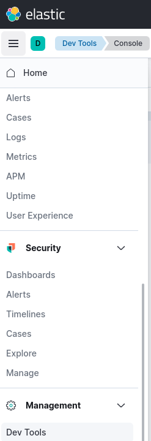
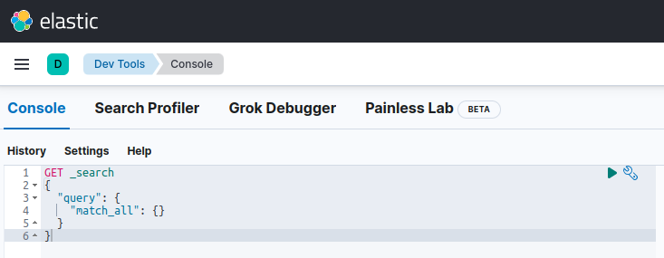
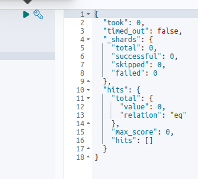

# ES install

In this lab we will practice the installation of the Elastic server.


Lab Goals:

* Install Elastic and verify its operation
* Prepare to use this installation instruction for all subsequent labs

### STEP 1) Login to the server

Each student is provided their individual server and credentials

(Instructor: use our ubuntu AMI, t2.large or t2.xlarge instances and Elasticsearch security group)

### STEP 2) Verify the environment

```bash
sudo apt install zip
sudo apt install unzip
curl -s "https://get.sdkman.io" | bash
source "$HOME/.sdkman/bin/sdkman-init.sh"
#sdk list java
sdk install java  11.0.16-amzn
```


Also, let's add the elasticsearch keys:

```bash
wget -qO - https://artifacts.elastic.co/GPG-KEY-elasticsearch | sudo apt-key add -
echo "deb https://artifacts.elastic.co/packages/7.x/apt stable main" | sudo tee -a /etc/apt/sources.list.d/elastic-7.x.list
sudo apt-get update

```


### STEP 3) Download and install ES


Download the latest version


```bash
wget https://artifacts.elastic.co/downloads/elasticsearch/elasticsearch-8.3.3-linux-x86_64.tar.gz
tar zxvf elasticsearch-8.3.3-linux-x86_64.tar.gz
cd elasticsearch-8.3.3/
```


### STEP 4) Start ES

    ./bin/elasticsearch

* To stop ES, do CTRL-C

* To start as a daemon, type

```shell
  ./elasticsearch-8.3.3/bin/elasticsearch -d -p pid
```

* For the daemon mode, verify the `pid` file content

```shell
find . -name pid
./elasticsearch-8.3.3/pid
cat ./elasticsearch-8.3.3/pid
```

* Now you can close the terminal if you want to, and it will keep running

* We will verify the install in Kibana

### STEP 5) Install Kibana

```shell
wget https://artifacts.elastic.co/downloads/kibana/kibana-8.3.3-linux-x86_64.tar.gz
tar xf kibana-8.3.3-linux-x86_64.tar.gz
```

* Edit the `config/kibana.yml`
* Put the following line in
```text
server.host: "0.0.0.0"
```

* You will need a token from Elastic. Here is how you get it
```shell
cd
cd elasticsearch-8.3.3/
bin/elasticsearch-create-enrollment-token --scope kibana
```

* Start Kibana
* If you want to keep it running, type
```shell
screen
```

* Use one of the two commands below

```shell
./kibana-8.3.3/bin/kibana 
./kibana-8.3.3/bin/kibana &
```

* Open the Kibana UI and verify the installation
* In the browser, open http://<your-url>:5601
* Go to DevTools-Console


* Console


* Click on the green button


### If you need to restore password

* In this directory `~/elasticsearch-8.3.3/bin`
```shell
./elasticsearch-reset-password -u elastic
```

* This will auto-generate password, and this will be your password for `elastic` user


