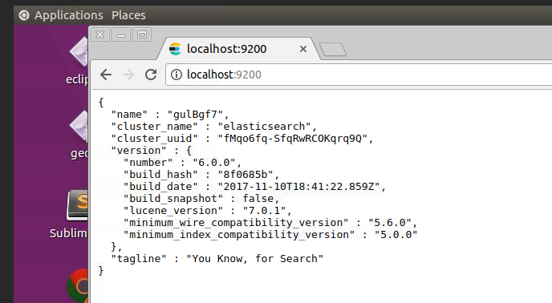

# ES indexing

In this lab we will practice indexing operations

Lab Goals:

* 

### STEP 1: Login to the server
 
Each student is provided their individual server and credentials

(Instructor: use our ubuntu AMI, t2.large or t2.xlarge instances and Elasticsearch security group)

### STEP 2: Index one document

    curl -XPUT 'localhost:9200/get-together/group/1?pretty' -d '{
    "name": "Elasticsearch Denver",
    "organizer": "Lee"
    }'

### STEP 3: Practice index create, list, delete

    curl -XPUT 'localhost:9200/new-index'
    
    curl -XDELETE 'localhost:9200/new-index'
    
    curl -XHEAD -I 'localhost:9200/new-index'

        
### STEP 4: List mapping

    curl 'localhost:9200/get-together/_mapping/group?pretty'
    
### STEP 5: Verify install

    curl 'http://localhost:9200/?pretty'
    
You should see an output like this

    {
      "name" : "gulBgf7",
      "cluster_name" : "elasticsearch",
      "cluster_uuid" : "fMqo6fq-SfqRwRCOKqrq9Q",
      "version" : {
        "number" : "6.0.0",
        "build_hash" : "8f0685b",
        "build_date" : "2017-11-10T18:41:22.859Z",
        "build_snapshot" : false,
        "lucene_version" : "7.0.1",
        "minimum_wire_compatibility_version" : "5.6.0",
        "minimum_index_compatibility_version" : "5.0.0"
      },
      "tagline" : "You Know, for Search"
    }

### STEP 6: Examine the logs.

The logs are found in the `logs` directory. Open the logs for examination

    nano logs/elasticsearch.log
    
or

    vi logs/elasticsearch.log
            
We have saved our logs [here](elasticsearch.log). You can use these if you cannot access
your logs.
 
Let’s take a look at some of those lines and what they mean.
The first line typically provides statistics about the node you started:

* Find your node name (it is random, but you can modify it in the configuration
* Find boung URL and port
* Find plugins
* Port 9300 is used by default for inter-node communication, called transport. Find this in the logs
* Port 9200 is used for HTTP communication by default. This is where applications
  using the REST API connect. Find it in the logs.

### STEP 7: Test the REST API in the browser

For this, you will need the Desktop UI, which the instructor will provide.

It should like like this image

  

## Additional advice

### Configuration parameters

    config/elasticsearch.yml

### Environment Variables

* The JAVA_OPTS passed to JVM is used by Elasticsearch

### Configuration files

    elasticsearch.yml

Configure different Elasticsearch modules.

    logging.yml
    
Configure the Elasticsearch logging
    
### STEP 8) ES options

    bin/elasticsearch 
or
    bin/elasticsearch --help
    
Study the options

