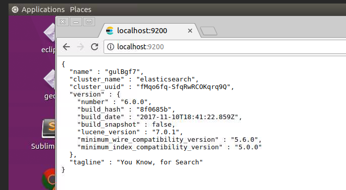

# ES install

In this lab we will practice the installation of the Elasticsearch server.


Lab Goals:

* Install Elasticsearch and verify its operation
* Prepare to use this installation instructions for all subsequent labs

### STEP 1: Login to the server

Each student is provided their individual server and credentials

(Instructor: use our ubuntu AMI, t2.large or t2.xlarge instances and Elasticsearch security group)

### STEP 2: Prepare the environment

Verify that you have Java installed

    java -version

Get the elastic-labs

    git clone git@github.com:elephantscale/elastic-labs.git    

### STEP 3: Download and install ES

```bash
wget https://artifacts.elastic.co/downloads/elasticsearch/elasticsearch-7.5.2-linux-x86_64.tar.gz
tar zxvf elasticsearch-7.5.2-linux-x86_64.tar.gz
rm -fr elasticsearch
mv elasticsearch-7.5.2 elasticsearch

```

### STEP 4: Start ES

    cd elasticsearch
    bin/elasticsearch

_Tip_: You can run it in the background as a daemon by using the -d option

    Try this

    bin/elasticsearch -d

### STEP 5: Verify install

    curl 'http://localhost:9200/?pretty'

You should see an output like this

    {
      "name" : "ip-172-16-0-244",
    "cluster_name" : "elasticsearch",
    "cluster_uuid" : "h4Tz5hgsSh-8UNacJ78HfQ",
    "version" : {
      "number" : "7.5.2",
      "build_flavor" : "default",
      "build_type" : "tar",
      "build_hash" : "8bec50e1e0ad29dad5653712cf3bb580cd1afcdf",
      "build_date" : "2020-01-15T12:11:52.313576Z",
      "build_snapshot" : false,
      "lucene_version" : "8.3.0",
      "minimum_wire_compatibility_version" : "6.8.0",
      "minimum_index_compatibility_version" : "6.0.0-beta1"
    },
    "tagline" : "You Know, for Search"
  }


### STEP 6: Examine the logs.

The logs are found in the `logs` directory. Open the logs for examination

    nano logs/elasticsearch.log

or

    vi logs/elasticsearch.log

We have saved our logs [here](elasticsearch.log). You can use these if you cannot access
your logs.

Let’s take a look at some of those lines and what they mean.
The first line typically provides statistics about the node you started:

* Find your node name (it is random, but you can modify it in the configuration
* Find bound URL and port
* Find plugins
* Port 9300 is used by default for inter-node communication, called transport. Find this in the logs
* Port 9200 is used for HTTP communication by default. This is where applications
  using the REST API connect. Find it in the logs.

### STEP 7: Test the REST API in the browser

For this, you will need the Desktop UI, which the instructor will provide.

It should like like this image

  

## Additional advice

### Configuration parameters

    config/elasticsearch.yml

### Environment Variables

* The JAVA_OPTS passed to JVM is used by Elasticsearch

### Configuration files

    elasticsearch.yml

Configure different Elasticsearch modules.

    logging.yml

Configure the Elasticsearch logging

### STEP 8) ES options

    bin/elasticsearch
or
    bin/elasticsearch --help

Study the options
