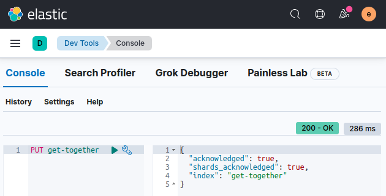
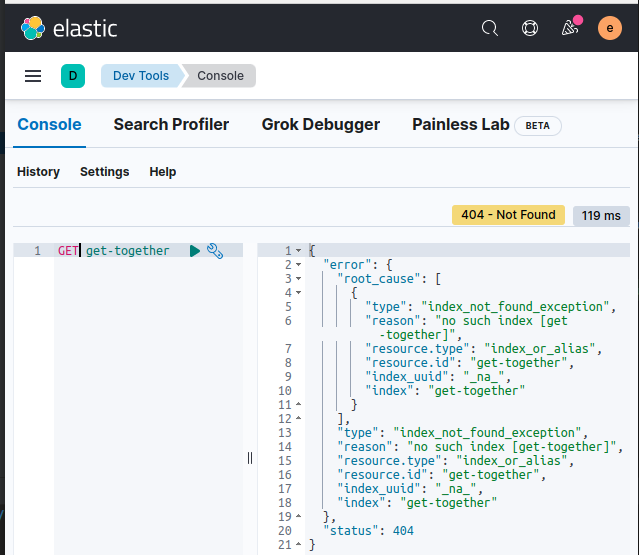

# ES indexing

In this lab we will practice indexing operations


Lab Goals:

* CRUD for indices, index documents.

### STEP 1: Login to Kibana

* Open Elastic-DevTools


* Display cluster health

```shell
GET _cluster/health
```


### Step 2: Make sure you don't already have the index by deleting it

Let's make sure we don't already have an index called get-together. To do this. we will try to delete it.  If it does *not* already exist, we will get an error. 
But that is fine.

* Try to delete the index, then create it, then read it.
* 
```bash
DELETE get-together
```

```bash
PUT get-together
```

```bash
GET get-together
```

If it **does** exist, you will get an acknowledgment like this;



Again, if the index does *not* exist, then you will get an error that says it is not found, which is fine.



* Create an index with more details
  
```text
PUT /my-index-000001
{
  "settings": {
    "index": {
      "number_of_shards": 3,  
      "number_of_replicas": 2 
    }
  }
}
```


### STEP 2: Index one document


```bash
PUT my-index/_doc/1
{
  "year": 2021,
  "city": "Melbourne",
  "country": "Australia",
  "population_M": 4.936
}
# Index a document with _id 2
PUT my-index/_doc/2
{
  "year": 2021,
  "city": "Sydney",
  "country": "Australia",
  "population_M": 5.23
}
```


* List all the document that we have just indexed

```bash
GET my-index/_search
```

* Here are the documents back!


* But what if I do not want to generate the document ID myself?

```bash
POST my-index/_doc/
{
  "year": "2021",
  "city": "Brisbane",
  "country": "Australia",
  "population_M": 2.28
}
POST my-index/_doc/
{
  "year": "2021",
  "city": "Canberra",
  "country": "Australia",
  "population_M": 0.395
}
```


* Two more documents were created

### STEP 3: Create and count more documents

* To create more documents, use the step above, applying it a few times

