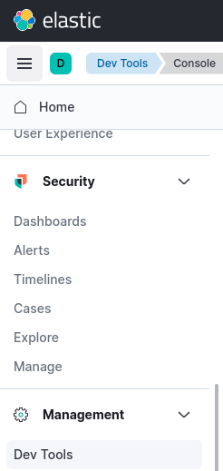
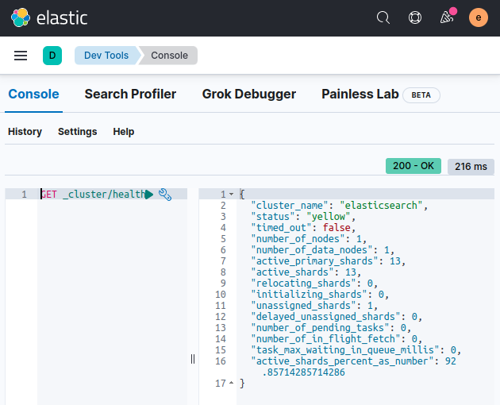
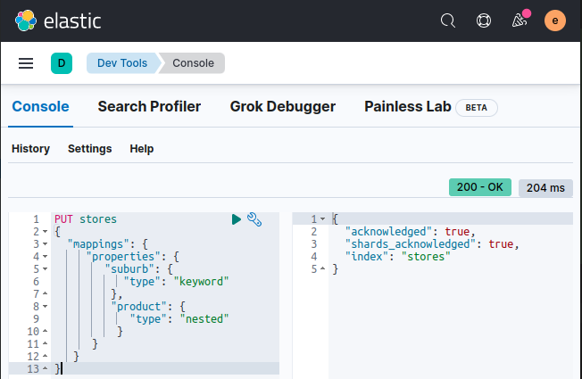
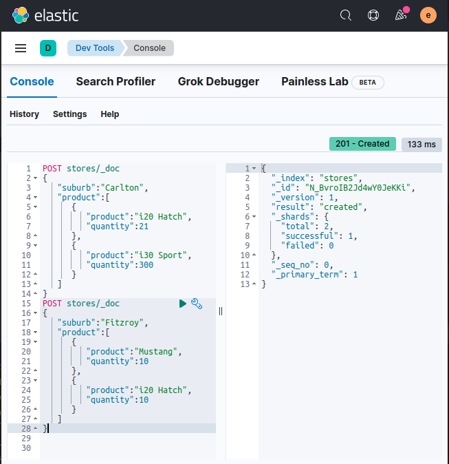
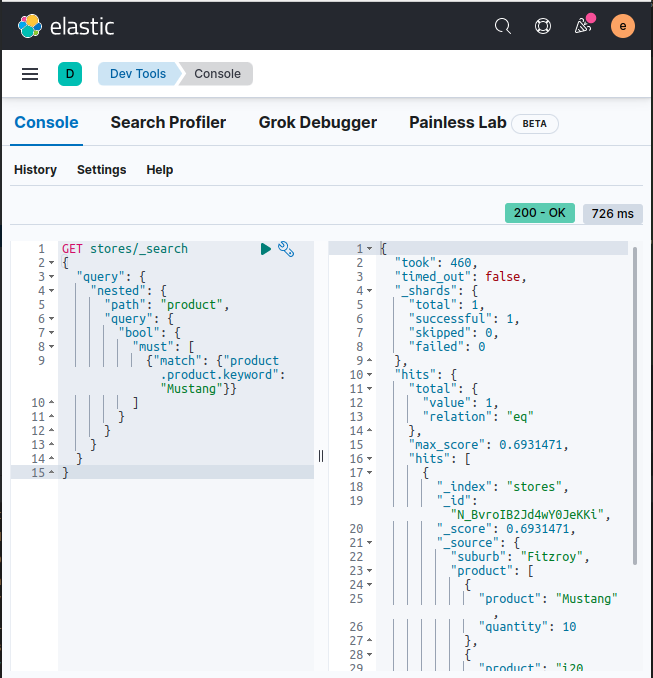
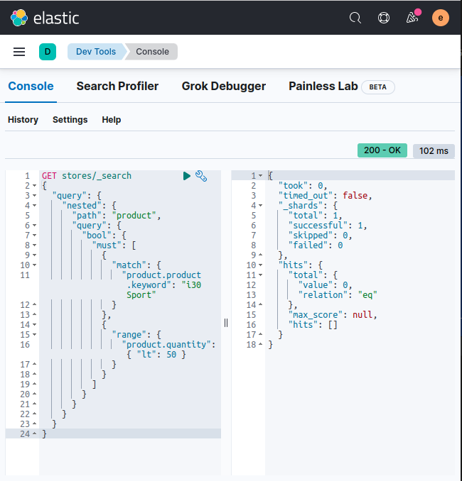

# ES mapping - joins

In this lab we will practice mapping for nested objects


Lab Goals:

* Get familiar with mapping of nested objects

### STEP 1: Login to Kibana

* Open Elastic-DevTools



* Display cluster health

```shell
GET _cluster/health
```


### Step 2: Create a new index

```text
PUT stores
{
  "mappings": {
     "properties": {
        "suburb": {
           "type": "keyword"
         },
         "product": {
            "type": "nested"
          }
      }
   }
}
```


* Add some data

```text
POST stores/_doc
{
   "suburb":"Carlton",
   "product":[
      {
         "product":"i20 Hatch",
         "quantity":21
      },
      {
         "product":"i30 Sport",
         "quantity":300
      }
   ]
}
POST stores/_doc
{
   "suburb":"Fitzroy",
   "product":[
      {
         "product":"Mustang",
         "quantity":10
      },
      {
         "product":"i20 Hatch",
         "quantity":10
      }
   ]
}



* Now, run a query to find all the stores that sell the Mustang product:

```text
GET stores/_search
{
  "query": {
    "nested": {
      "path": "product",
      "query": {
        "bool": {
          "must": [
            {"match": {"product.product.keyword": "Mustang"}}
          ]
        }
      }
    }
  }
}
```

* As expected, a hit for the store in Fitzroy is returned, along with its inventory:



* Now, to return all the stores with less than 50 units of i30 Sport, run the following code:
```text
GET stores/_search
{
  "query": {
    "nested": {
      "path": "product",
      "query": {
        "bool": {
          "must": [
            {
              "match": {
                "product.product.keyword": "i30 Sport"
              }
            },
            {
              "range": {
                "product.quantity": { "lt": 50 }
              }
            }
          ]
        }
      }
    }
  }
}
```

   
* As expected, no stores matching the query are returned:



