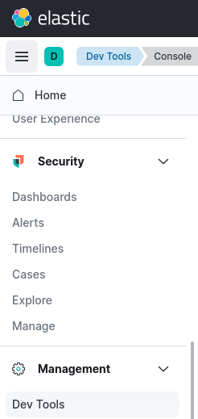

# ES index templates

In this lab we will practice index mapping


Lab Goals:

* Get familiar with mapping

### STEP 1: Login to Kibana

* Open Elastic-DevTools



* Display cluster health

```shell
GET _cluster/health
```


```text
PUT _index_template/logs-firewall
{
  "index_patterns": [
    "firewall-logs*"
  ],
  "template": {
    "settings": {
      "number_of_shards": 2
    },
    "mappings": {
      "properties": {
        "@timestamp": { "type": "date" },
        "source.ip": { "type": "ip" },
        "destination.ip": { "type": "ip" },
        "event.action": { "type": "keyword" },
        "user.name": { "type": "keyword" },
        "client.bytes": { "type": "double"}
      }
    }
  }
}
```
```text
POST firewall-logs-10.12.2020/_doc
{
  "@timestamp": "2020-12-23T03:53:36.431Z",
  "source.ip": "10.12.100.2",
  "destination.ip": "10.15.10.2",
  "event.action": "deny",
  "user.name": "bob",
  "client.bytes": 2
}
```


```text
GET firewall-logs-10.12.2020
```

