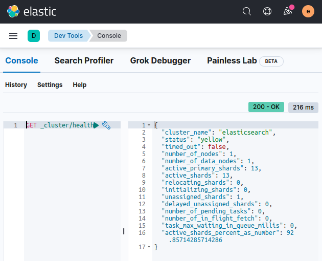

# ES indexing

In this lab we will practice indexing operations


Lab Goals:

* Open an index.

### STEP 1: Login to Kibana

* Open Elastic-DevTools


* Display cluster health

```shell
GET _cluster/health
```


### Step 2: Make sure you don't already have the index by deleting it

Let's make sure we don't already have an index called get-together. To do this. we will try to delete it.  If it does *not* already exist, we will get an error. 
But that is fine.

* Try to delete the index, then create it, then read it.
* 
```bash
DELETE get-together
```

```bash
PUT get-together
```

```bash
GET get-together
```

If it **does** exist, you will get an acknowledgment like this;


Again, if the index does *not* exist, then you will get an error that says it is not found, which is fine.


### STEP 2: Index one document

All put requests in elastic require a content type, usually json. That means adding this to all PUT requests like this:

```bash

curl -XPUT -H 'Content-type: application/json'
```

This is a bit of a hassle, so feel free to make an alias like this:

```bash
alias curl="/usr/bin/curl -H 'Content-type: application/json' "
```

However, if you do make the alias, you don't want to separately postpend `-H 'Content-type: application/json'` because it will then say that you have *two* content headers, which isn't allowed. 
Watch out for that.


```bash
    curl -XPUT  -H 'Content-type: application/json' "localhost:9200/get-together/group/1 " -d '{
    "name": "Elasticsearch Denver",
    "organizer": "Lee"
    }'
```


If that doesn't work, you may have the alias set in which case you can try this:

```bash
    curl -XPUT  "localhost:9200/get-together/group/1 " -d '{
    "name": "Elasticsearch Denver",
    "organizer": "Lee"
    }'

```

### STEP 3: Practice index create, list, delete

    curl -XPUT 127.0.0.1:9200/new-index

    curl -XDELETE 'localhost:9200/new-index'

    curl -XHEAD -I 'localhost:9200/new-index'


### STEP 4: List mapping

    curl 'localhost:9200/get-together/_mapping/group?pretty'
