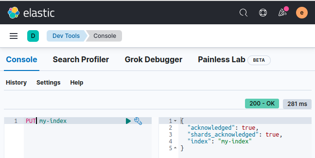
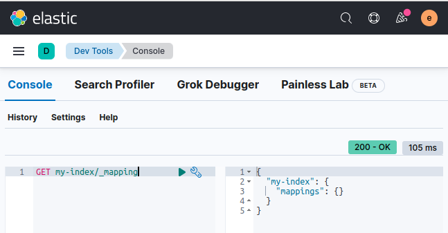
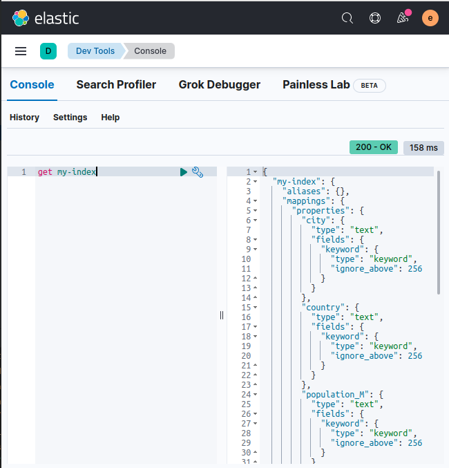

# ES mapping

In this lab we will practice index mapping


Lab Goals:

* Get familiar with mapping

### STEP 1: Login to Kibana

* Open Elastic-DevTools


* Display cluster health

```shell
GET _cluster/health
```


### Step 2: Clean up the index by deleting it

```text
DELETE my-index
```

* Then recreate it

```text
PUT my-index
```



* Examine the default mapping

```text
GET my-index
```

* Pay special attention to the mappings

```text
GET my-index/_mapping
```


* Now add a document to the index. Based on the previous lab, you should be able to add the necessary verb. (Hint: use POST my-index/_doc/)

```text
{
  "year": 2021,
  "city": "Brisbane",
  "country": "Australia",
  "population_M": 2.28
}
```

* Now you can examine the auto-generated mapping




### Step 3: Index a document with problematic mapping

```text
POST my-index/_doc/
{
  "year": "2021",
  "city": "Perth",
  "country": "Australia",
  "population_M": "1.95 million"
}
```

