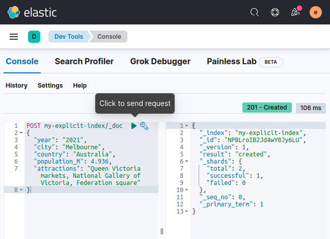
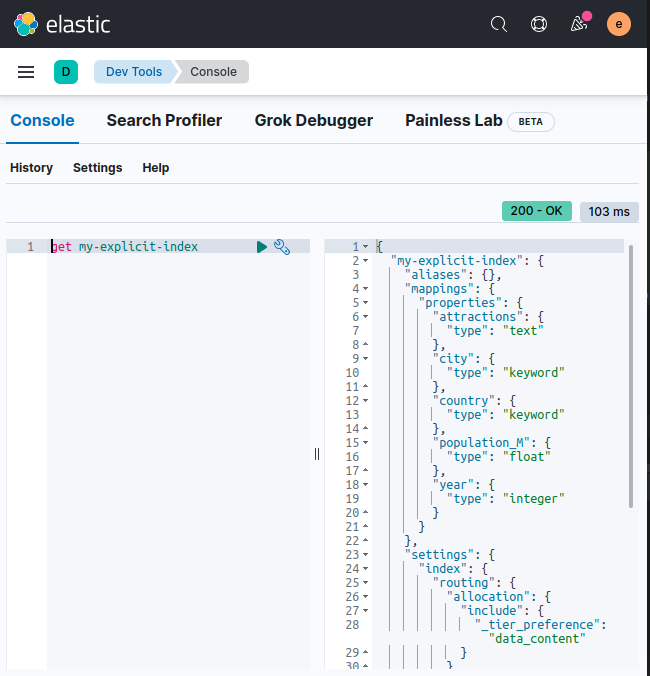
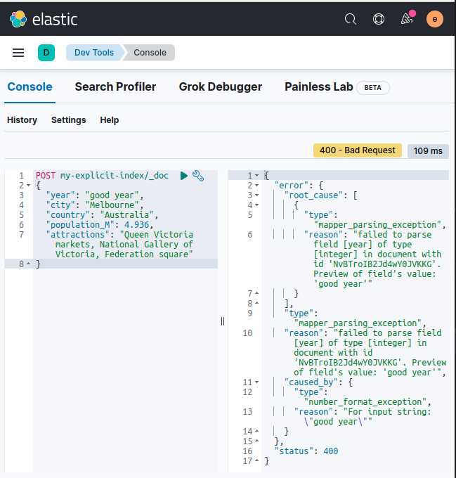

# ES mapping

In this lab we will practice index mapping


Lab Goals:

* Get familiar with mapping

### STEP 1: Login to Kibana

* Open Elastic-DevTools


* Display cluster health

```shell
GET _cluster/health
```


### Step 2: Clean up the index by deleting it

```text
DELETE my-index
```

* Then recreate it

```text
PUT my-index
```


* Examine the default mapping

```text
GET my-index
```

* Pay special attention to the mappings

```text
GET my-index/_mapping
```


* Now add a document to the index. Based on the previous lab, you should be able to add the necessary verb. (Hint: use POST my-index/_doc/)

```text
{
  "year": 2021,
  "city": "Brisbane",
  "country": "Australia",
  "population_M": 2.28
}
```

* Now you can examine the auto-generated mapping


### Step 3: Index a document with problematic mapping

```text
POST my-index/_doc/
{
  "year": "2021",
  "city": "Perth",
  "country": "Australia",
  "population_M": "1.95 million"
}
```

* You might get an exception

* Better, give the mapping explicitly

```text
PUT my-explicit-index
{
  "mappings": {
    "properties": {
      "year": {
        "type": "integer"
      },
      "city": {
        "type": "keyword"
      },
      "country": {
        "type": "keyword"
      },
      "population_M":{
        "type": "float"
      },
      "attractions": {
        "type": "text"
      }
    }
  }
}
```


* Now you can index a document with explicit mapping

```text
POST my-explicit-index/_doc
{
  "year": "2021",
  "city": "Melbourne",
  "country": "Australia",
  "population_M": 4.936,
  "attractions": "Queen Victoria markets, National Gallery of Victoria, Federation square"
}
```



* Verify that this worked

```text
{
  "my-explicit-index": {
    "aliases": {},
    "mappings": {
      "properties": {
        "attractions": {
          "type": "text"
        },
        "city": {
          "type": "keyword"
        },
        "country": {
          "type": "keyword"
        },
        "population_M": {
          "type": "float"
        },
        "year": {
          "type": "integer"
        }
      }
    },
    "settings": {
      "index": {
        "routing": {
          "allocation": {
            "include": {
              "_tier_preference": "data_content"
            }
          }
        },
        "number_of_shards": "1",
        "provided_name": "my-explicit-index",
        "creation_date": "1660781232417",
        "number_of_replicas": "1",
        "uuid": "DT5pJqccQD67Q0QTT9SV5w",
        "version": {
          "created": "8030399"
        }
      }
    }
  }
}
```



* Now try a wrongly formatted year

```text 
POST my-explicit-index/_doc
{
  "year": "good year",
  "city": "Melbourne",
  "country": "Australia",
  "population_M": 4.936,
  "attractions": "Queen Victoria markets, National Gallery of Victoria, Federation square"
}
```



* This is error-checking
