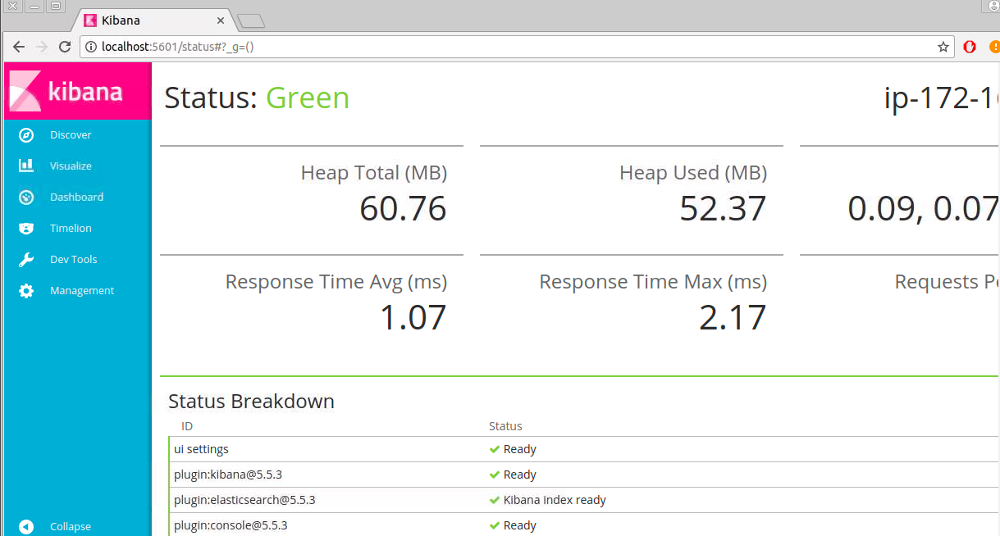

# ES install

In this lab we will practice the installation of Kibana.

Lab Goals:

### STEP 1: Login to the server
 
Each student is provided their individual server and credentials

(Instructor: use our ubuntu AMI, t2.large or t2.xlarge instances and Elasticsearch security group)

### STEP 2: Downaload and unpack
 
    wget wget https://s3.amazonaws.com/elephantscale-public/downloads/kibana-5.5.3-linux-x86_64.tar.gz
    tar -xzf kibana-5.5.3-linux-x86_64.tar.gz
    mv kibana-5.5.3-linux-x86_64 kibana
    
### STEP 3: Start Kibana

    cd kibana/
    ./bin/kibana
    
Configuring Kibana via config fileedit
Kibana loads its configuration from the $KIBANA_HOME/config/kibana.yml file by default. 
The format of this config file is explained in [Configuring Kibana](https://www.elastic.co/guide/en/kibana/5.5/settings.html).

### STEP 4: Accessing Kibanaedit

Kibana is a web application that you access through port 5601. All you need to do is point your web browser at the machine where Kibana is running and specify the port number. For example, localhost:5601

When you access Kibana, the Discover page loads by default with the default index pattern selected. The time filter is set to the last 15 minutes and the search query is set to match-all (\*).

If you don’t see any documents, try setting the time filter to a wider time range. If you still don’t see any results, it’s possible that you don’t have any documents.

### STEP 5: Checking Kibana Status

You can reach the Kibana server’s status page by navigating to localhost:5601/status. The status page displays information about the server’s resource usage and lists the installed plugins.

You should an output similar to this one

