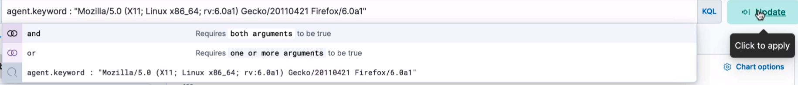
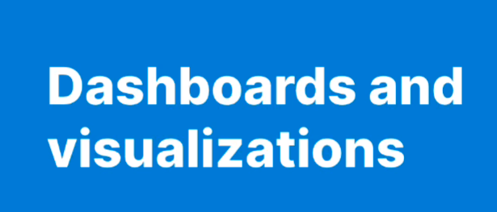
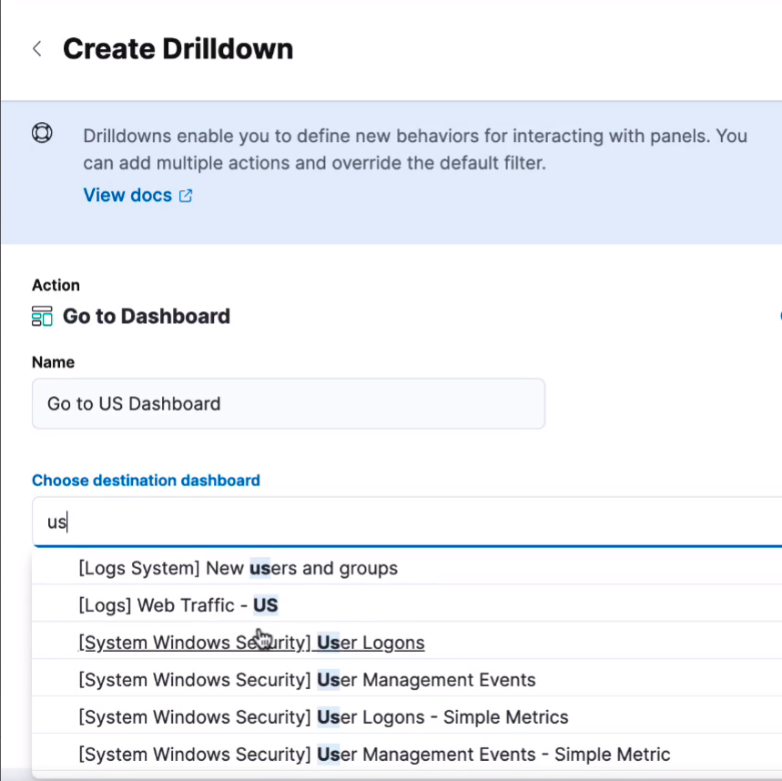

# Kibana capabilities

In this lab we will Kibana capabilities.

Lab Goals: Practicing Kibana capabilities

### Let us have an overview of what Kibana capabilities are, using provided data sets

* Open Kibana. You see three different solutions and also analytics. We will go to analytics but first let's look at sample data.

* You could add data from other different data sources.
* You could add an Integration or upload file.

* But we will start with the sample data, because it is the fastest way to get started.

* You see three different sample data sets. Let us chose the sample web logs. That is because Kibana comes with pre-build visualizations and dashboards.
* While the web logs are loading, we can look around. But it won't be long.

* When you click on "View Data", you can choose different ways of investigation.

* While it is loading, you can look around.

* Here are different ways of investigation.

* Chose "Discover"

* Here is data discovery display

* You can look at different data fields

* Each field will show more information about itself.

* If you click on one of these, you will a popout with top five values. For some, we have less than five.

* In the center, you have the chart of the data, with each individual log entry being a document.
* Expand a document and watch an additional screen pop up.

* While inspecting a document, you can click on the "JSON" button to see the raw JSON.
* Now you can see the document in it native format as it is stored in Elasticsearch.

* You can choose specific fields to display.

* You can adjust the display of the chart.

* Look at the time picker on the top right.

* You see three different sample data sets

* Let us update to 2 weeks ago. And let us investigate more controls.

* Adjust more controls.

* Go back to the data and refresh.

* Now you can do a search. We are using KQL, Kibana Query Language.

* You can use filters and temporarily disable some part of the filter.

* In that way, you can make your filters travel with you.

* Again, you can pin and unpin filters.

* A new feature is Kibana 8 is field statistics.

* You can analyze the field statistics and look, say, number of documents with a specific field value.

* Go back and click on geo.dest

* And now we can visualize it.

* Now let's investigate dashboards and visualizations.

* Back to the menu and then choose "Dashboards".

* So here we are at the dashboard screen. In Discover, we analyzed the data and the fields.
* By contrast, in Dashboards, we can create at-a-glance visualizations and dashboards, and then go deeper.
* Here is a list of dashboards.

* Let us go to logs traffic dashboard.
* At the top, we have search query bar, date range picker, we can add filters or keep the filters that we have used. 

* Look around the dashboard, analyze metrics and visualizations, charts, maps, heat map, bar charts.

* Scroll down, analyze different other dashboard elements.

* Back at the top, you see controls with preset filters.

* You can see that the dashboards and all their elements are interactive.

* You see three different sample data sets

* You can go to the 'gear' and create a Drill-down.

* In creating the drill-down, you can choose different fields to display.

* Create US dashboard.

* Refer and add a link to a specific dashboard.

* Jump to the US dashboard. You may see where it is different from the global traffic dashboard.

* You can edit dashboard. Chose the "Edit lens".

* Now we are editing it. This is Kibana Lens, the main visualization editor.

* You can save your visualization and use it elsewhere. 

* You can start from scratch and create a new visualization, or you can borrow the existing ones. Then update, save, and use it.

* Now let us look at Canvas and Elastic Maps.

* Go to Analytics and select "Canvas"

* Here is the Canvas screen for the same logs web traffic.

* Canvas is a tool for building pixel-perfect visual presentations for live data.

* You see three different sample data sets

* Canvas is an editor. You can choose "Background" and select your color.

* You can change the CSS style.

* Analyze and edit a selected element.

* And what is this? It is a diagram of moving violations in the area.

* Another example: moving violations in the area, with the analytics and numbers.

