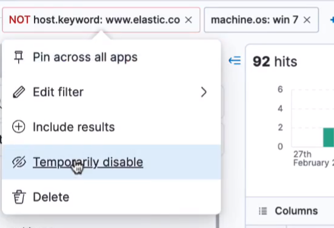
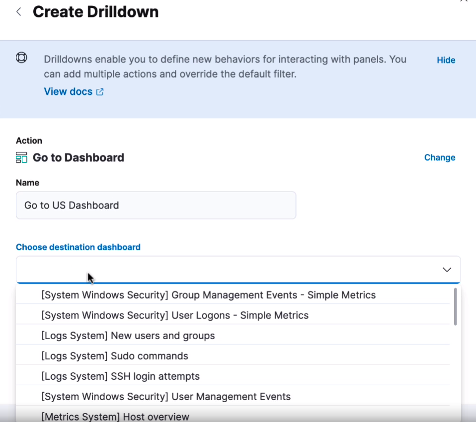

# Kibana capabilities

In this lab we will Kibana capabilities.

Lab Goals: Practicing Kibana capabilities

### Let us have an overview of what Kibana capabilities are, using provided data sets

* Open Kibana. You see three different solutions and also analytics. We will go to analytics but first let's look at sample data.

* You could add data from other different data sources.
* You could add an Integration or upload file.

* But we will start with the sample data, because it is the fastest way to get started.

* You see three different sample data sets. Let us chose the sample web logs. That is because Kibana comes with pre-build visualizations and dashboards.
* While the web logs are loading, we can look around. But it won't be long.

* When you click on "View Data", you can choose different ways of investigation.

* While it is loading, you can look around.

* Here are different ways of investigation.

* Chose "Discover"

* Here is data discovery display

* You can look at different data fields

* Each field will show more information about itself.

* If you click on one of these, you will a popout with top five values. For some, we have less than five.

* In the center, you have the chart of the data, with each individual log entry being a document.
* Expand a document and watch an additional screen pop up.

* While inspecting a document, you can click on the "JSON" button to see the raw JSON.

* You see three different sample data sets

* You see three different sample data sets

* You see three different sample data sets

* You see three different sample data sets

* You see three different sample data sets

* You see three different sample data sets

* You see three different sample data sets

* You see three different sample data sets

* You see three different sample data sets

* You see three different sample data sets

* You see three different sample data sets

* You see three different sample data sets

* You see three different sample data sets

* You see three different sample data sets

* You see three different sample data sets

* You see three different sample data sets

* You see three different sample data sets

* You see three different sample data sets

* You see three different sample data sets

* You see three different sample data sets

* You see three different sample data sets

* You see three different sample data sets

* You see three different sample data sets

* You see three different sample data sets

* You see three different sample data sets

* You see three different sample data sets

* You see three different sample data sets

* You see three different sample data sets

* You see three different sample data sets

* You see three different sample data sets

* You see three different sample data sets

* You see three different sample data sets

* You see three different sample data sets

* You see three different sample data sets

* You see three different sample data sets

* You see three different sample data sets

* You see three different sample data sets

* You see three different sample data sets

* You see three different sample data sets

* You see three different sample data sets

* You see three different sample data sets

* You see three different sample data sets

