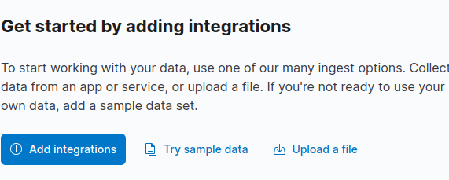

# Kibana capabilities

In this lab we will Kibana capabilities.

Lab Goals: Practicing Kibana capabilities

### Let us have an overview of what Kibana capabilities are, using provided data sets

* Open Kibana. You see three different solutions and also analytics. We will go to analytics but first let's look at sample data.

* You could add data from other different data sources.
* You could add an Integration or upload file.

* But we will start with the sample data, because it is the fastest way to get started.

* You see three different sample data sets. Let us chose the sample web logs.

* You see three different sample data sets

* You see three different sample data sets

* You see three different sample data sets

* You see three different sample data sets

* You see three different sample data sets

* You see three different sample data sets

* You see three different sample data sets

* You see three different sample data sets

* You see three different sample data sets

* You see three different sample data sets

* You see three different sample data sets

* You see three different sample data sets

* You see three different sample data sets

* You see three different sample data sets

* You see three different sample data sets

* You see three different sample data sets

* You see three different sample data sets

* You see three different sample data sets

* You see three different sample data sets

* You see three different sample data sets

* You see three different sample data sets

* You see three different sample data sets

* You see three different sample data sets

* You see three different sample data sets

* You see three different sample data sets

* You see three different sample data sets

* You see three different sample data sets

* You see three different sample data sets

* You see three different sample data sets

* You see three different sample data sets

* You see three different sample data sets

* You see three different sample data sets

* You see three different sample data sets

* You see three different sample data sets

* You see three different sample data sets

* You see three different sample data sets

* You see three different sample data sets

* You see three different sample data sets

* You see three different sample data sets

* You see three different sample data sets

* You see three different sample data sets

* You see three different sample data sets

* You see three different sample data sets

* You see three different sample data sets

* You see three different sample data sets

* You see three different sample data sets

* You see three different sample data sets

* You see three different sample data sets

* You see three different sample data sets

* You see three different sample data sets

* You see three different sample data sets

* You see three different sample data sets

