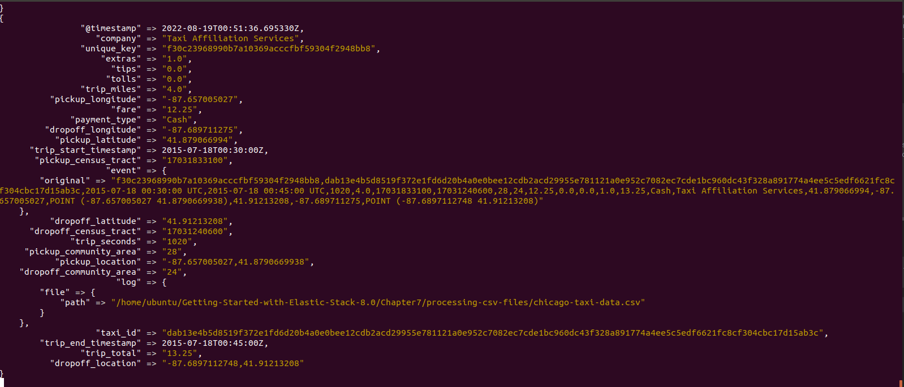
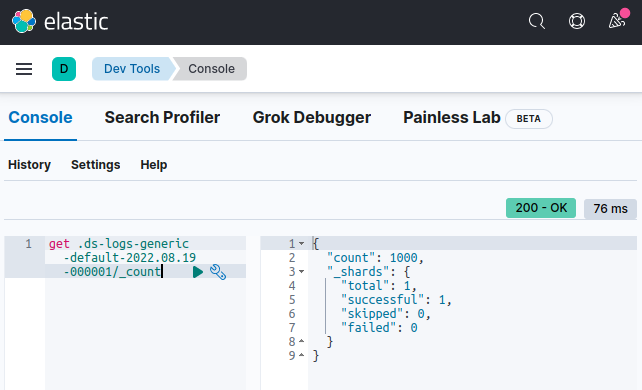

# Logstash first pipeline

In this lab we will test Logstash with a simple pipeline.


### STEP 1: Login to the server

Each student is provided their individual server and credentials

(Instructor: use our ubuntu AMI, t2.large or t2.xlarge instances and Elasticsearch security group)

First make sure Java 8+ is installed:

```bash
java -version
```

### STEP 2: Create a new logstash-pipeline.conf
* Clone some data
```shell```
git clone https://github.com/elephantscale/Getting-Started-with-Elastic-Stack-8.0.git
```


* Set the following in `logstash-taxi.conf` in the following directory:

```text
/home/ubuntu/Getting-Started-with-Elastic-Stack-8.0/Chapter7/processing-csv-files/
```
* Point to the right file

```text
input {
    file {
                path => "/home/ubuntu/Getting-Started-with-Elastic-Stack-8.0/Chapter7/processing-csv-files/chicago-taxi-data.csv"
                start_position => "beginning"
                sincedb_clean_after => "1 s"
        }
}
```

* Adjust the output

```text
output {
    stdout {}
    elasticsearch {
        # configure the Elasticsearch output plugin parameters with your cluster details
        hosts => "http://localhost:9200"
        user => "elastic"
        password =>""
    }
}

```
### STEP 3: Run logstash

```bash
 /usr/share/logstash/bin/logstash -f /home/ubuntu/Getting-Started-with-Elastic-Stack-8.0/Chapter7/processing-csv-files/logstash-taxi.conf 
```

* Observe the events



* See the new index and 1000 records in it




