# Anomaly Detection

### Lab Goals:
* Run anomaly detection job

### STEP 1: Install Elasticsearch, Kibana, and ML license

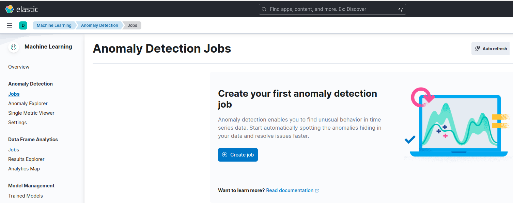

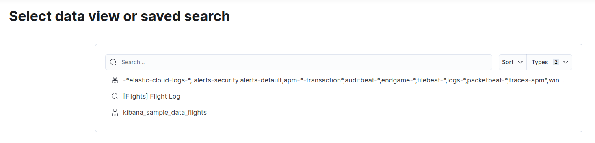
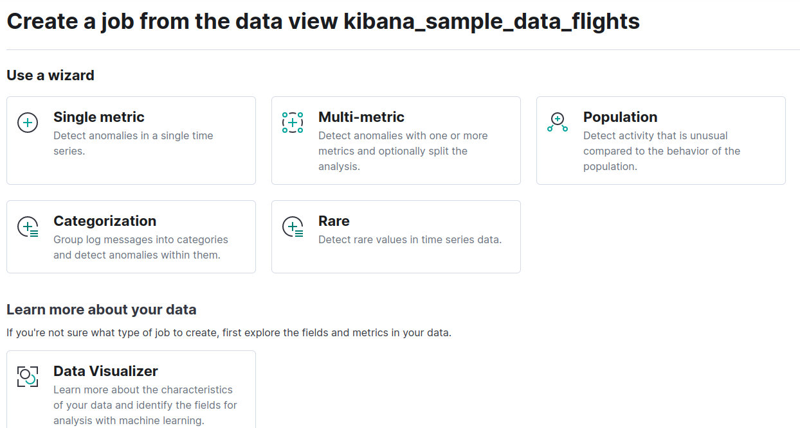
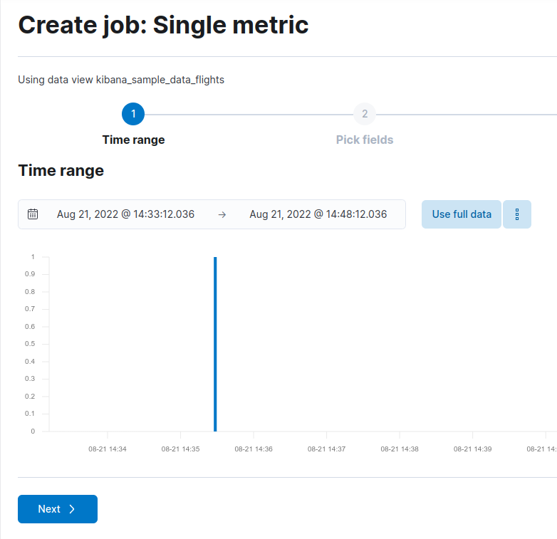
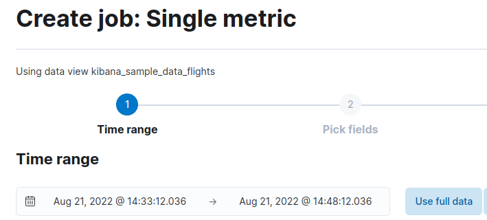
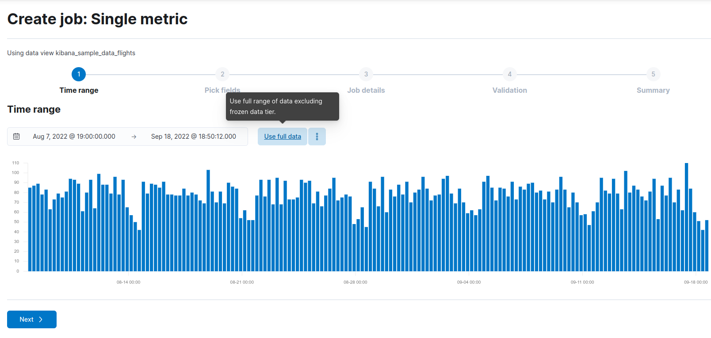
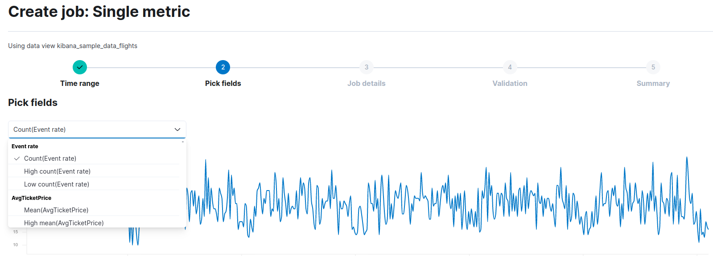
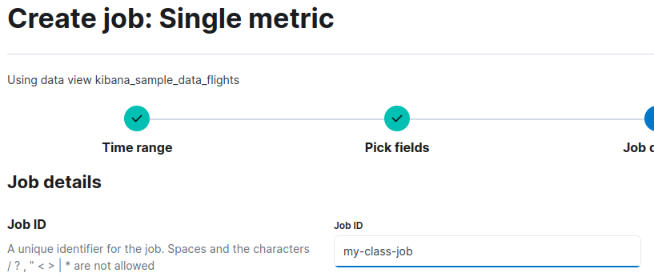
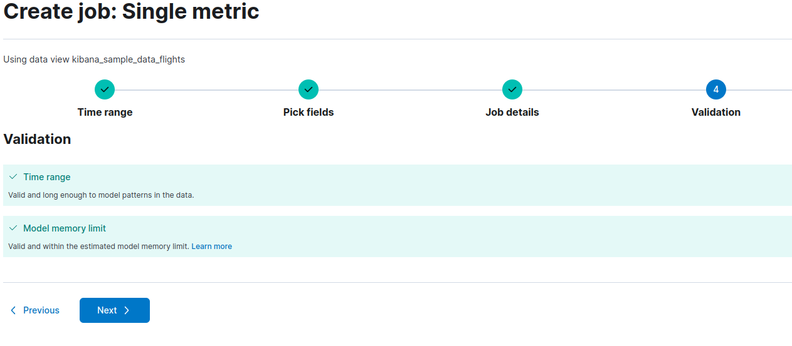
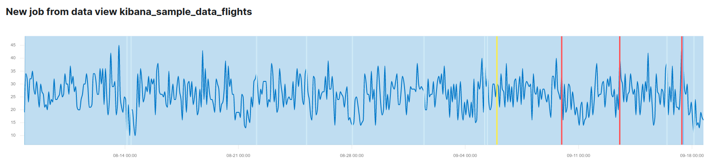
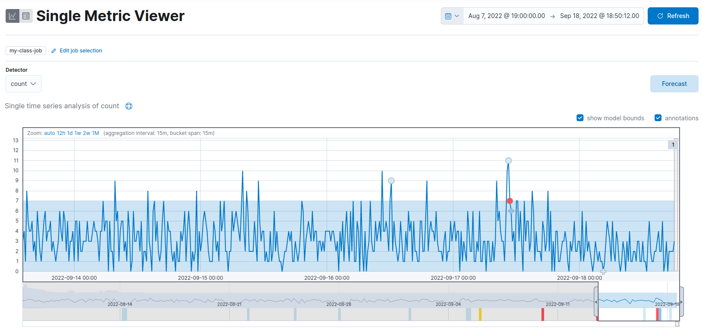
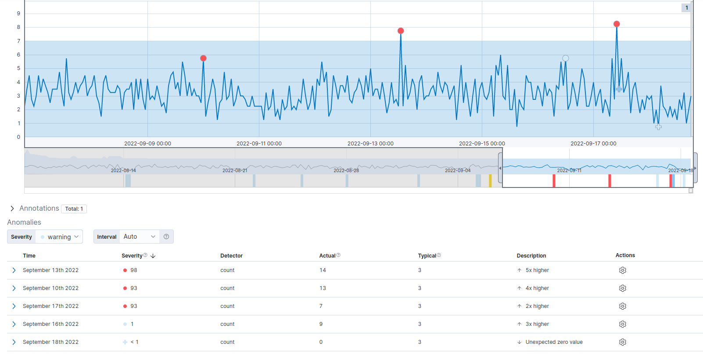
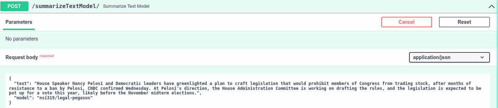
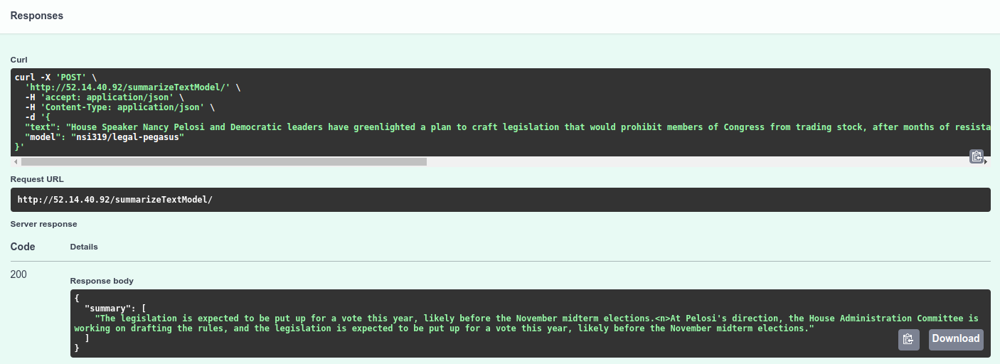

### STEP 2: Congratulations! You have run an anomaly detection job
