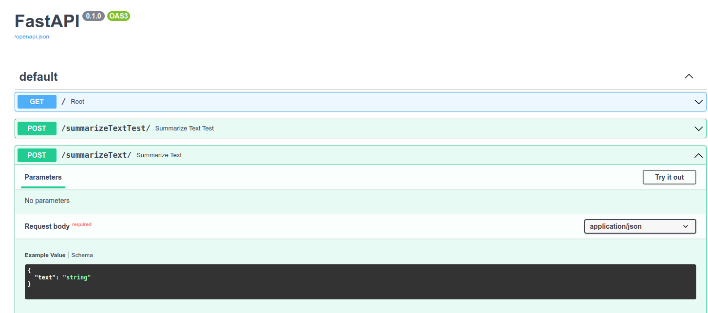
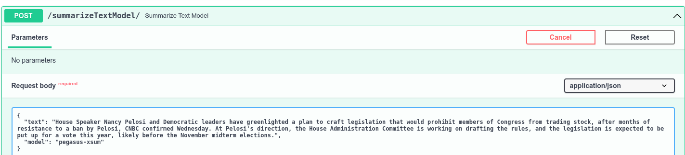

# Test Summarizer

### Lab Goals:
* Get familiar with text summarizer

### STEP 1: Go to the summarizer API

* Open the [URL](http://52.14.40.92/docs#)

### STEP 2: Run the given example

* Click on "Summarize Text", then "Try it"

* Enter the following text
```text
House Speaker Nancy Pelosi and Democratic leaders have greenlighted a plan to craft legislation that would prohibit members of Congress from trading stock, after months of resistance to a ban by Pelosi, CNBC confirmed Wednesday. At Pelosi's direction, the House Administration Committee is working on drafting the rules, and the legislation is expected to be put up for a vote this year, likely before the November midterm elections.
```

* Observe the results

```text
Members of Congress could soon be banned from trading on the stock market.
```

### Step 3: Run the given example with your choice of model




* Click on "SummarizeTextModel", then "Try it"
* Choose the model you want to use, from the list. Start with `nsi319/legal-pegasus`


```text
            {"google/pegasus-xsum", "News"},
            {"google/bigbird-pegasus-large-arxiv", "Long documents"},
            {"google/pegasus-cnn_dailymail", "Email",},
            {"google/pegasus-newsroom", "News important point",},
            {"google/pegasus-pubmed", "Medical long sentences",},
            {"google/pegasus-wikihow", "wiki",},
            {"google/pegasus-reddit_tifu", "reddit",},
            {"google/pegasus-billsum", "Another news",},
            {"google/roberta2roberta_L-24_cnn_daily_mail", "Another email",},
            {"nsi319/legal-pegasus", "Legal",}
```

### STEP 4: Try your examples with your choice of models. Which worked best for your use case?