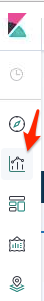

# Elastic Stack Lab15

In this lab we will install and configure Kibana to use as a dashboard for Elasticsearch

Add the4 following if you have not done so already:

```bash
wget -qO - https://artifacts.elastic.co/GPG-KEY-elasticsearch | sudo apt-key add -
sudo apt-get install apt-transport-https
echo "deb https://artifacts.elastic.co/packages/7.x/apt stable main" | sudo tee -a /etc/apt/sources.list.d/elastic-7.x.list
sudo apt-get update
```

Start by installing it. 
```
sudo apt-get update && sudo apt-get install -y kibana 
```

Now we need to edit the configuration file 
```
sudo vi /etc/kibana/kibana.yml
```

Uncomment and change the `server.host` to `0.0.0.0` to allow external connections. 

Now reload everything 
```
sudo /bin/systemctl daemon-reload
sudo /bin/systemctl enable kibana.service
sudo /bin/systemctl start kibana.service
```

Kibana can take a few minutes to start, wait about 3 minutes then visit http://VMIP on port 5601 or go here http://localhost:5601/ in your browser.


You should see something like this.
Click on **Explore on my own**


## Interact with Kibana 
Now that we have Kibana installed let's have some fun with it! 

First let's start by clicking the "Management" link on the left side and then "Index Patterns". 


Then click "Create index pattern". This will take you to a new screen where you can select the index you would like to see data for. 


On this screen under `Index pattern` type in "shakespeare" and then click `Next step`, 

On the next screen click `Create index pattern`

Once that's complete you should see a screen like this


Now let's go explore the index we just added. 

Click `Discover` in the top left, 


then in the search bar type `speaker:GLOUCESTER` and click **Update** to look at the results. 

You can see he was in a lot of plays.  Now  we can click on `play name` in the `Available Fields` section and see exactly what plays he was in.


For fun go ahead and click on the Visualize button 


This will take you to a screen that looks similar to this 


It is very easy to get dynamically generated graphs and charts using Kibana. 

Now click on Visualize on the left side bar.



Click on `Create a visualization`

Click Tag Cloud at the bottom of the screen


In the new window click `shakespeare`


One you do that click on `Tags` on the left under `Buckets`


On this page fill in the following 
* Aggregation: Terms
* Field: text_entry
* Size: 100

After filling that in click the play button at the top of screen.


You should see a really interesting screen with the most popular text in Shakespeare's plays. 


Take some time to click around and explore Kibana. 

# Lab Complete 


