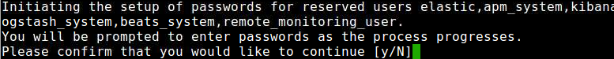
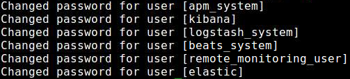
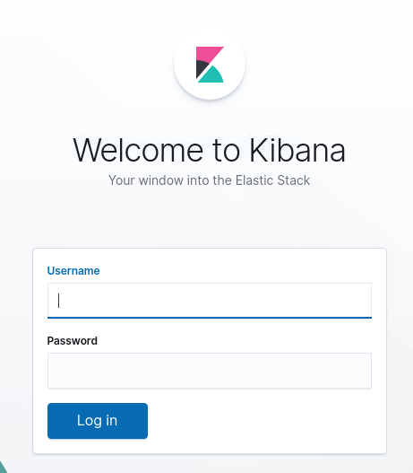
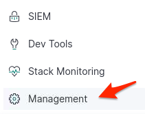
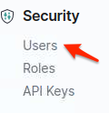
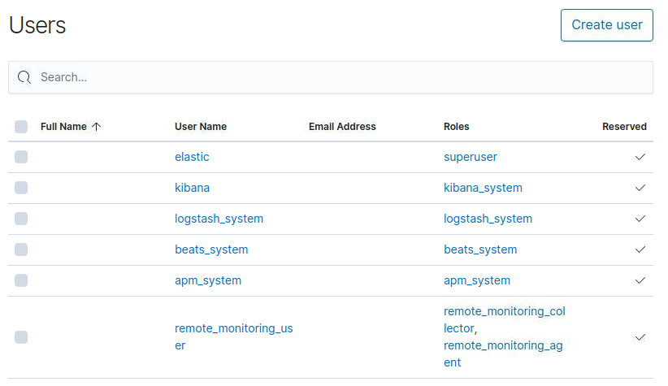
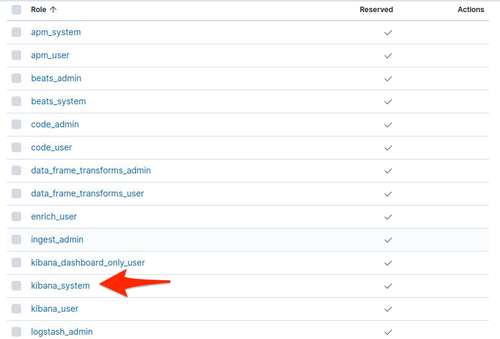
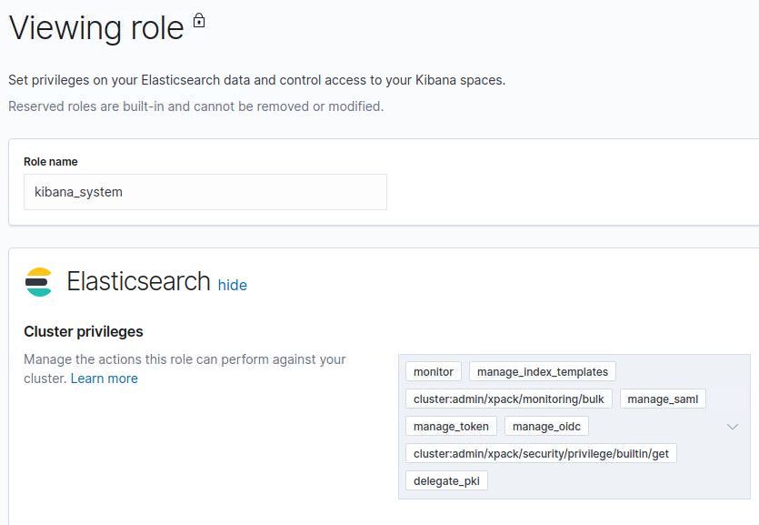
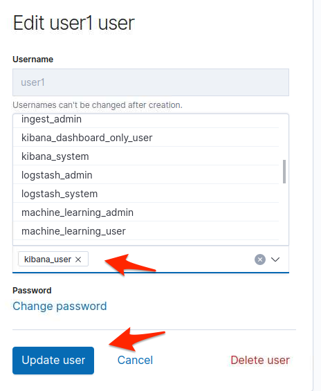

# Elastic Stack Lab16

In this lab we are going to configure Kibana to use the X-Pack plugin which will enable monitoring, alerting and many other features.

### Enable Elasticsearch security features
We will need to stop Elasticsearch and Kibana first.  

To stop and start elasticsearch
First find the PID
``` jps | grep elasticsearch
```
You should get something like this
*14542 Elasticsearch*

To stop Elasticsearch Example

```
kill -SIGTERM 14542
```

To stop and Kibana
```
sudo -i service kibana stop
```


Let's restart that node

Security must be implicity enabled when using a basic license.  

We will security by setting xpack.security.enabled = true in the elasticsearch.yml file.

First open your elasticsearch yml file with your favorite editor, it will be in your elasticsearch directory.

Example
```
vi ~/elasticsearch/config/elasticsearch.yml
```
Once in editor add this line to Cluster

```
xpack.security.enabled: true
```
Then add this load to Discover
```
discovery.type: single-node
```
Save and Exit.

 ### Create passwords for built-in users

 Restart elastisearch, run command from your elasticsearch directory.

 ```
 ./elasticsearch/bin/elasticsearch -d
 ```

 Set the built-in users' passwords
 ```
 ./elasticsearch/bin/elasticsearch-setup-passwords interactive
 ```
 You should get the following prompt.

 

 Type **y** to continue then **Enter**

 Enter a password for *elastic* let's keep it simple to remember and just enter **password123**

 Enter a password for *amp_system* enter same password **password123**

  Enter a password for *kibana* enter same password **password123**

  Enter a password for *logstash* enter same password **password123**

  Enter a password for *beats_system* enter same password **password123**

  Enter a password for *remote_monitoring_user* enter same password **password123**

  You should get the following if successful.

  

### Add the built-in user to kibana
When elasticsearch security features are enabled, users must log in to Kibana with a valid user ID and password.

Configure Kibana to use the built-in Kibana user and the password that you created.

Edit the kibana.yml
```
sudo vi /etc/kibana/kibana.yml
```

Add the following settings.
```
elasticsearch.username: "elastic"
elasticsearch.password: "your_password"
```
Specify the password that you set with the elasticsearch-setup-passwords command then save your changes to the file.

If you prefer not to put your user ID and password in the kibana.yml file, store them in a keystore instead. Run the following commands to create the Kibana keystore and add the secure settings:

```
./bin/kibana-keystore create
./bin/kibana-keystore add elasticsearch.username
./bin/kibana-keystore add elasticsearch.password
```

When prompted, specify the kibana built-in user and its password for these setting values. The settings are automatically applied when you start Kibana.

Restart Kibana.
```
sudo service kibana start
```
Open up Kibana in a browser:
http://127.0.0.1:5601

If worked correctly you should get a login page to Kibana.

  

Enter your username: *elastic* and password you set *password123*

### Create users

Let's create two users in the native realm
Click on **Management** the gears icon.  
  

then Security and click **Users**  

  

You should see the following.
  

Fill out the fields but don't choose a role yet.

You can make your own user or use the following:  
 - Username: User1
 - Password: password123
 - Full name: user one
 - Email: user@user.com

Click **Create User** to create a user for yourself.

If done correctly your user will have been created.
    

Click **Create user** and create a logstash_internal user.

In Getting started with the Elastic Stack, you configured Logstash to listen for Metricbeat input and to send the events to Elasticsearch. You therefore need to create a user that Logstash can use to communicate with Elasticsearch.
- Username: logstash_internal
- Password: password123
- Full name: logstash internal
- Email: logstash@logstash.com

Click **Create user**

### Assign roles
By default, all users can change their own passwords, get information about themselves, and run the authenticate API. If you want them to do more than that, you need to give them one or more roles.

Each role defines a specific set of actions (such as read, create, or delete) that can be performed on specific secured resources (such as indices, aliases, documents, fields, or clusters). To help you get up and running, there are built-in roles.

Go to the **Management**(Gears icon) / **Security** / **Roles** page to see them:

Select a role to see more information about its privileges. For example, select the **kibana_system** role to see its list of cluster and index privileges.

 

You should see the following:

 

Go back to the **Management**(Gears icon) / **Security** / **User**

Let’s assign the kibana_user role to your user. Click on your user if you used the example it should be *user1* Add the kibana_user role and click **Update user**.

 

This user now has access to all features in Kibana. For more information about granting access to Kibana see Kibana Authorization.

If you completed all of the steps in Getting started with the Elastic Stack, you should have Metricbeat data stored in Elasticsearch. Let’s create two roles that grant different levels of access to that data.

Go to the **Management** / **Security** / **Roles** page and click **Create role.**

Create a filebeat_reader role that has the following:

 - Role name: metricbeat_reader
 - Indices: filebeat
 - Priviliges read and view_index_meta_data


Scroll down and Click **Create role**

   

Congrats you've successfully set up authentication and authorization by using the native realm.  You learned how to create user IDs and roles that prevent unauthorized access to Elastic Stack.

# Lab Complete
