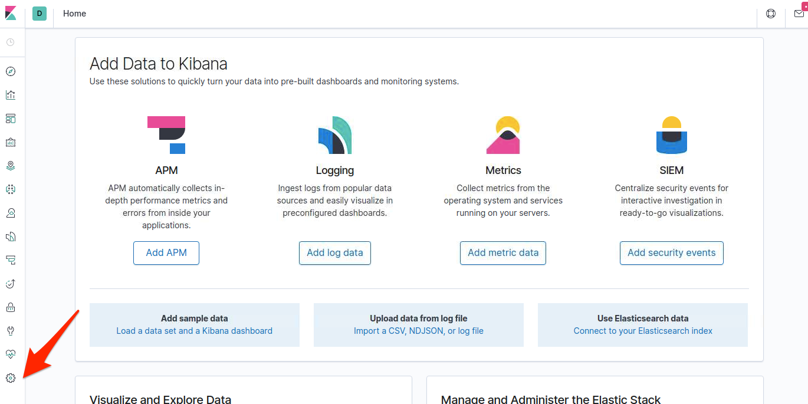
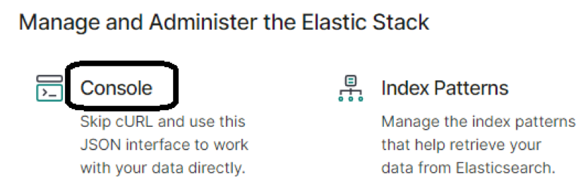
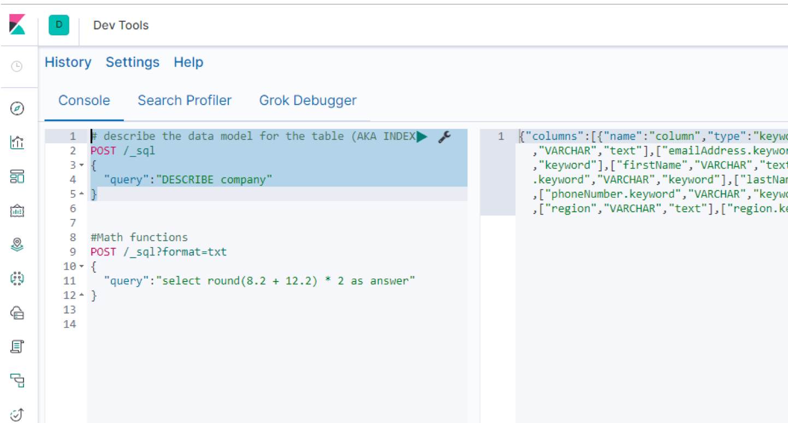
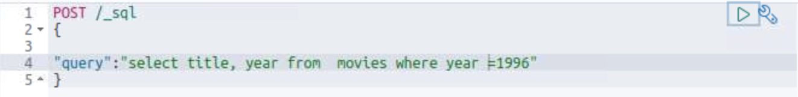

# Elastic Stack Lab 19

In this lab we will be using the Kibana Console to make SQL quries

## Launch Kibana.

If you have not downloaded and configured and kibana yet, go back to lab 15 for those instructions.

Launch Kibana


## Create a new index pattern for movies

First let's start by clicking the "Management" link on the left side and then "Index Patterns".



Then click "Create index pattern". This will take you to a new screen where you can select the index you would like to see data for.


On this screen under Index pattern type in "movies" to match up with our movies index created in the previous labs and then click Next step,

On the next screen click Create index pattern

Now navigate back to the main menu

## Launch console

Scroll down and click on the console so that we can write queries.







## Run queries

Try the following queries:


Query 1:
```SQL
# describe the data model for the table (AKA INDEX)
POST /_sql
{
  "query":"DESCRIBE movies"
}

```

Query 2:
```SQL

#return standard elasticsearch output format
POST /_sql
{
  "query":"select title From movies"
}

#return CSV
POST /_sql?format=csv
{
  "query":"select title From movies"
}
```
Query 3:
```SQL
#return standard SQL query output format
POST /_sql?format=text/plain
{
  "query":"select title,year From movies"
}

#Shorter syntax with limit
POST /_sql?format=txt
{
  "query":"select title,year From movies limit 10"
}

```

Query 4:
```sql
# Use where statement
POST /_sql
{
  "query":"query":"select title,year From movies where year = 1996"
}

```


Query 5:
```SQL
#Math functions
POST /_sql?format=txt
{
  "query":"select round(8.2 + 12.2) * 2 as answer"
}
```


# Lab Complete
