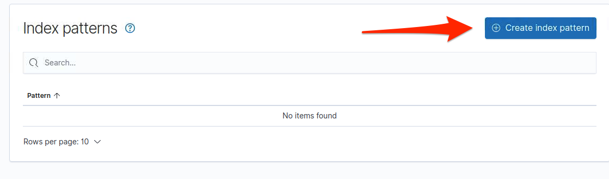
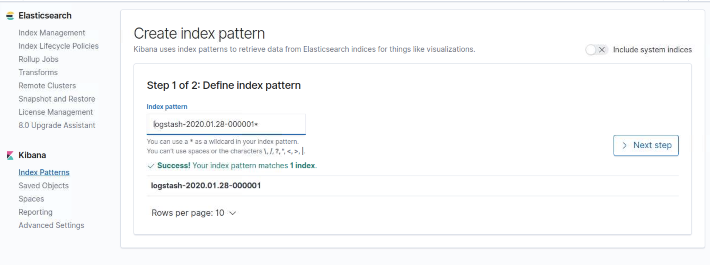
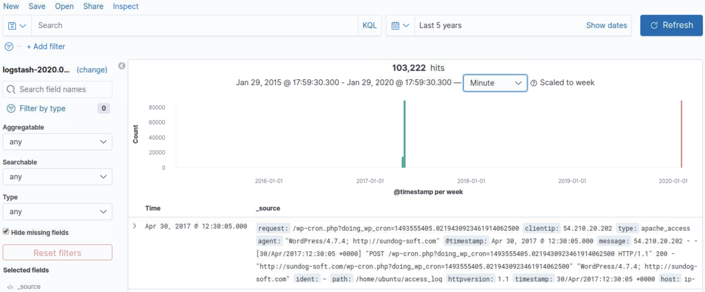

# Elastic Stack Lab 20
In this lab we are going to Parse Logs with Logstash and then visualize in kibana


We will create a Logstash pipeline that  writes the parsed data to an Elasticsearch cluster.   Rather than defining the pipeline configuration at the command line, You'll define the pipeline in a config file.  

### Download Sample data
If you have not set up logstash yet, look at the 13-logstash lab for instructions on how to set up the access log.


### Configuring Logstash
Navigate to logstash directory
```bash
cd /etc/logstash/
```
We will edit our logstash config file to allow for ip logging.

```bash
sudo vi /etc/logstash/conf.d/logstash.conf
```

Add in this information to the correct fields: This will allow filebeats to connect with logstash and use the geoip plugin.

Take a second to look at the configuration file. We configured logstash previously to update automatically if we change the config file.

```bash
input {
 file {
      path => "/home/ubuntu/access_log"
        start_position => "beginning"
}
}


filter {
  if [path] =~ "access" {
    mutate { replace => { "type" => "apache_access" } }
  grok {
  match => { "message" => "%{COMBINEDAPACHELOG}" }
  }
geoip {
  source => "clientip"
}
}
date {
  match => [ "timestamp" , "dd/MMM/yyyy:HH:mm:ss Z" ]
}
}

output {
elasticsearch {
  hosts => ["localhost:9200"]
  }
stdout { codec => rubydebug }
    }
```

We can now test our configuration from the logstash directory.
```bash
cd ~logstash/
bin/logstash -f logstash.conf --config.test_and_exit
```

## Test new index
Take a look at the new index using the following command and find the new index in the format logstash-[Date]
```bash
curl 'localhost:9200/_cat/indices?v'
```
Now take that index for the following query:

```bash
curl -XGET 'localhost:9200/logstash-2020.01.28-000001/_search?pretty&q=response=200'

```

## Visualize in Kibana
Now let's open up kibana. Create a new index pattern for the new logstash index. Then go to discover and look at the log information over the past 5 years.





# Lab Complete
