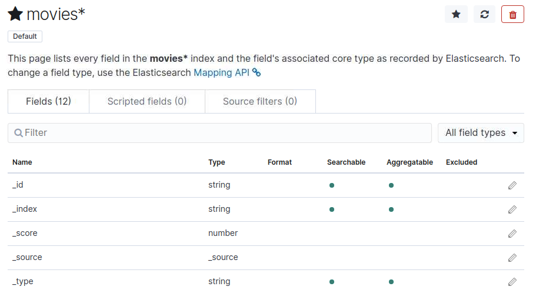
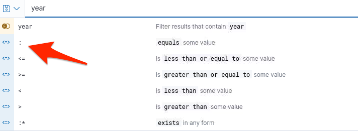
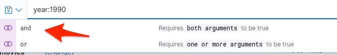
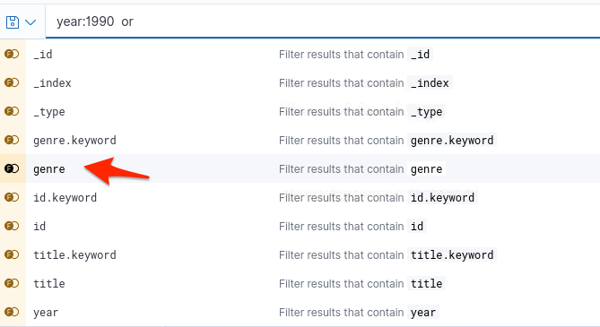
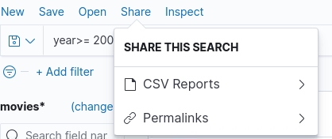
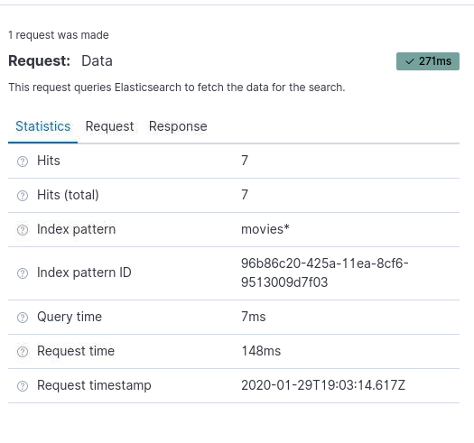

# Elastic Stack Lab 21
In this lab we are going to use our movielens data set with Kibana.


### Loading movie data set.
You should have the moremovies.json already lets load it into elasticsearch through it's API.

```
curl -XPUT 127.0.0.1:9200/_bulk?pretty --data-binary @movies.json
```

### Start Kibana

Once data set is loaded go to http://localhost:5601/ in your browser.

###  Create an Index Pattern

Just like in the previous lab to create an Index Pattern
- Click on **Management** on left side
 - Click on **Index Patterns**
  - Click on  **Create index pattern**
   - Search for **movies**.  
   - Once you find your movies index click **Next** step
   - On next screen click **Create index pattern**

Once that's complete you should see the following screen:



### Explore the movie data.  

Click on the discover icon that looks like a compass on the left to explore the movies index.

In the available fields click on  **genre**
What are the top 5 genre's?

#### Kibana Query Language
Kibana's query language includes scripted filed support and a simplified, easier to use syntax.  

Let's make a simple Query using the Kibana Query Language.

Type year in the query bar.  
You will notice that a drop down with attribute to that field will show.  



Let's select *1990* then click **Update**

How many hits did that get?

Let's continue with this and input *year:1990* then space.  



As you will notice it will initiate more parameters like the usage of *and* and *or*.  Select **and**



You can now select which field you want to use for this demonstration let's select **genre** and equal it to *action*.  Click **Update**

How many hits did that get?
What if we select *Action and Adventure*?

See if you can make a query finding movies from the year *2000* to the present with the *Golden* in the title.

You can share these results by saving it into a *csv* or creating a *permalink*  you can share.  



Click on Inspect to check out total Hits, Query time, and other statistics.  



Make your own queries from this movies index.  
Here is one to get you started.  

Find a *Childrens* movie with *war* in the title.    
