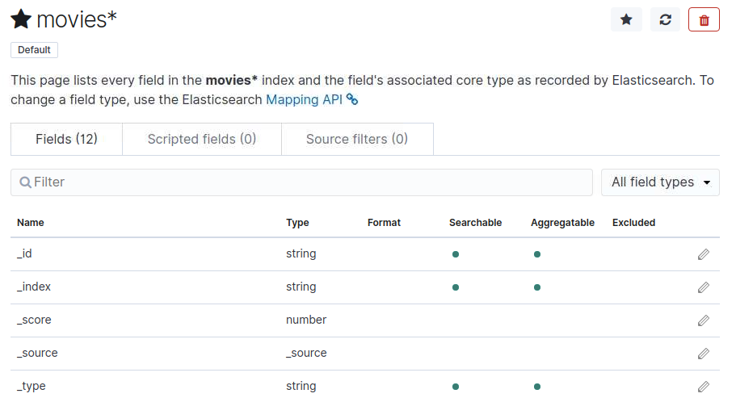

# Elastic Stack Lab 21
In this lab we are going to use our movielens data set with Kibana.


### Loading movie data set.
You should have the moremovies.json already lets load it into elasticsearch through it's API.

```
curl -XPUT 127.0.0.1:9200/_bulk?pretty --data-binary @movies.json
```

### Start Kibana

Once data set is loaded go to http://localhost:5601/ in your browser.

Just like in the previous lab click on **Management** on left side, **Index Patterns**, **Create index pattern**, search for **movies**.  Once you find your movies index click **Next** step and on next screen click **Create index pattern**

Once that's complete you should see the following screen:



Click on the discover icon that looks like a compass on the left to explore the movies index.

In the search bar type **genre**
What are the top 5 genre's?
