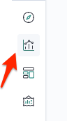

# Elastic Stack Lab 22
In this lab we are going to load data into Kibana, use the dev console, and build a dashboard.


### Downloading the data sets
We need 3 data sets for this tutorial we will include the previous shakespeare data set with this tutorial and add 2 more.  

```
curl -O https://download.elastic.co/demos/kibana/gettingstarted/8.x/accounts.zip
curl -O https://download.elastic.co/demos/kibana/gettingstarted/8.x/logs.jsonl.gz
```
If you don't have the shakespeare dataset simply download here.  

```
wget http://bit.ly/es-shakes-data -O shakespeare_6.0.json
```

Two of the datasets are compressed lets uncompress them.
```
unzip accounts.zip
gunzip logs.jsonl.gz
```

You can view the structure of the datasets by using your favorite text editor

```
vi logs.jsonl
```

You should see the following structure.

```
{
    "memory": INT,
    "geo.coordinates": "geo_point"
    "@timestamp": "date"
}
```
Try it with the accounts.json.

Before we setup mapping let's delete the shakespeare index if you have it set already.  

```
curl -XDELETE 127.0.0.1:9200/shakespeare
```


### Setup mappings
For this we will open the Kibana Dev Tools Console.  
Simply click on the **Kibana** logo on the top left screen to go to Dev Tools.

### Start Kibana

Once data set is loaded go to http://localhost:5601/ in your browser.


Scroll down and under Manage and Administer Elastic Slack click **Console**


This is what we will use to setup the mapping for the data sets.

Let's start with the shakespeare data.  
Clear the console and map the following.

```
PUT /shakespeare
{
  "mappings": {
    "properties": {
    "speaker": {"type": "keyword"},
    "play_name": {"type": "keyword"},
    "line_id": {"type": "integer"},
    "speech_number": {"type": "integer"}
    }
  }
}
```

Click the play button to set the mapping.  


You should get **acknowledged: true** if it worked correctly.

This mapping specifies field characteristics for the data set:
 - The **speaker** and **play_name** fields are keyword fields. These fields are not analyzed.  The strings are treated as a single unit even if they contain multiple words.  
 - The **line_id** and **speech_number** fields are integers.

 The logs data set requires mapping to label the latitude and longitude pairs as geographic locations by applying the **geo_point** type.

 ```
 PUT /logstash-2015.05.18
{
  "mappings": {
    "properties": {
      "geo": {
        "properties": {
          "coordinates": {
            "type": "geo_point"
          }
        }
      }
    }
  }
}
```

```
PUT /logstash-2015.05.19
{
  "mappings": {
    "properties": {
      "geo": {
        "properties": {
          "coordinates": {
            "type": "geo_point"
          }
        }
      }
    }
  }
}
```

```
PUT /logstash-2015.05.20
{
  "mappings": {
    "properties": {
      "geo": {
        "properties": {
          "coordinates": {
            "type": "geo_point"
          }
        }
      }
    }
  }
}
```

The accounts data set does not require any mapping.

### Load the data sets.
We will be using the Elasticsearch bulk API to load the data sets:

If you have not set your curl alias you may need to add this.  -H 'Content-Type: application/x-ndjson'

```
curl -XPOST 'localhost:9200/bank/_bulk?pretty' --data-binary @accounts.json
curl -XPOST 'localhost:9200/_bulk?pretty' --data-binary @logs.jsonl
```
If you haven't loaded the shakespeare data set yet do it now. Skip this if you have it already preloaded.

```
curl -XPOST 'localhost:9200/shakespeare/_bulk?pretty' --data-binary @shakespeare_6.0.json
```

Verify if successful you should see the index's you made.
```
curl -X GET "localhost:9200/_cat/indices?v&pretty"
```

### Define your index pattern
As with the previous tutorial we need to define the index pattern first.
 1. In Kibana, open Management, and then click Index Patterns.
2. If this is your first index pattern, the Create index pattern page opens automatically. Otherwise, click Create index pattern.
3. Enter shakes* in the Index pattern field. To find shakespeare.
4. Click Next step.
5. In Configure settings, click Create index pattern.

You’re presented a table of all fields and associated data types in the index.

Return to the Index patterns overview page and define a second index pattern named ba* for banks and do the same for that index.

### Create an Index for time series data
1.  Define an index pattern named **logstash*.**


2. Click **Next step**

3.  Open the **Time Filter field name** dropdown and select **@timestamp.**


###  Discover your data

1.  Open Discover it is the compass icon on the left.
Change the current index to ba* by clicking **change**


2.  In the search field, enter the following:
```
account_number<100 AND balance>47500
```


What were the results?   
How many hits do you get?  
Play with this to find who has the lowest balance.

3.  To choose which fields to display, hover the pointer over the list of Available fields and then click add next to each field you want include as a column in the table.

For example, if you add the account_number field, the display changes to a list of five account numbers.


Add an age field and see the age ranges of those with the balance.

### Visualize your data.
In the Visualize application, you can shape your data using a variety of charts, tables, and maps, and more.  We will create the following charts:  
 - Pie chart
 - Bar chart
 - Map
 - Markdown widget

#### Pie chart

Use Pie chart to gain insight into the account balances in the bank account data.

1.  Open Visualize to show the overview page.  It will be graph icon on left.  




2. Click Create new visualization. You’ll see all the visualization types in Kibana.  Scroll down and click **Pie**.


3.  In choose a source select **ba*** index pattern

Initially, the pie contains a single "slice." That’s because the default search matched all documents.

To specify which slices to display in the pie, you use an Elasticsearch bucket aggregation. This aggregation sorts the documents that match your search criteria into different categories. You’ll use a bucket aggregation to establish multiple ranges of account balances and find out how many accounts fall into each range.

4.  In the Buckets pane, click Add > Split slices.


5.  In the Aggregation dropdown, select **Range**.
6.  In the Field dropdown, select **balance**.
7.  Click **Add range** four times to bring the total number of ranges to six.


8. Define the following ranges:
```
0             999
1000         2999
3000         6999
7000        14999
15000       30999
31000       50000
```
9.  Click the play icon to Apply Changes.

Now you can see what proportion of the accounts fall into each balance range.

10.  Add another bucket aggregation that looks at the ages of the account holders.
 - At the bottom of the **Buckets** pane, click **Add**.
 - For sub-bucket type, select **Split slices**.
 - In the Sub aggregation dropdown, select **Terms**.
 - In the Field dropdown, select **age**.

Now you can see the break down of the ages of the account holders, displayed in a ring around the balance ranges.


Try adding another sub-bucket with gender and check out the results.

11.  To save the chart so you can use it later, click **Save** in the top menu bar and enter *Pie_Example*

#### Bar chart
Use a bar chart to look at the Shakespeare data set and compare the number of speaking parts in the plays.

1.  Click on **Visualize** on the top left and then click **Create Visualization**  

2.  Create a Vertical Bar chart and set the search source to shakes*.


Initially, the chart is a single bar that shows the total count of documents that match the default wildcard query.

3.  Show the number of speaking parts per play along the Y-axis.
 - In the Metrics pane, expand **Y-axis**.
 - Set Aggregation to **Unique Count**.
 - Set Field to **speaker**.
 - In the Custom label box, enter **Speaking Parts**.
 - Click the **play** icon to Apply Changes.

 

4.  Show the plays along the X-axis.
 - In the Buckets pane, click **Add** > X-axis.
 - Set Aggregation to **Terms**.
 - Set Field to **play_name**.
 - To list plays alphabetically, in the Order dropdown, select **Ascending**.
 - Give the axis a custom label, **Play Name**.
 - Click the **play** icon to Apply Changes.

 

Hovering over a bar shows a tooltip with the number of speaking parts for that play.

Notice how the individual play names show up as whole phrases, instead of broken into individual words. This is the result of the mapping you did at the beginning of the tutorial, when you marked the play_name field as not analyzed.

 6.  Save this chart with the name *Bar_example*.

#### Create a Markdown visualization.
Create a Markdown widget to add formatted text to your dashboard.

1.  Click on **Visualize** on the top left and then click **Create Visualization**  then select **Markdown**

2.  Copy the following text into the text box.
```
# This is a tutorial dashboard!
The Markdown widget uses **markdown** syntax.
> Blockquotes in Markdown use the > character.
```

3.  Click Apply changes **Play icon** button.
 - The Markdown renders in the preview pane.


 4. Save this visualization with the name *Markdown_example*.

 #### Map
Using Elastic Maps, you can visualize geographic information in the log file sample data.

1.  Click **Maps** in the New Visualization menu to create a Map.


2.  Set the time.
 - In the time filter, click **Show dates**.
 - Click the start date, then *Absolute*.
 - Set the **Start date** to *May 18, 2015*.
 - In the time filter, click **now**, then **Absolute**.
 - Set the **End date** to *May 20, 2015*.
 - Click **Update**


3. Map the geo coordinates from the log files.

 - Click **Add layer**.
 - Click the **Grid aggregation** data source.
 - Set **Index pattern** to **logstash**.
 - Click the **Add layer** button.


4.  Set the layer style.
 - Scroll down till you find **layer style**.
 - For **Fill color**, select the yellow to red color ramp.
 - For **Border color**, select white.
 - Click **Save & close**.

 

 Zoom in to focus on the USA map.  It should look like this.  

 

 5.  Navigate the map by clicking and dragging. Use the controls on the left to zoom the map and set filters.

6.  Save this map with the name Map_example.

#### Dashboard

A dashboard is a collection of visualizations that you can arrange and share. You’ll build a dashboard that contains the visualizations and map that you saved during this tutorial.

1.  Open Dashboard there will be an icon on the left you can click.  

 

2. On the Dashboard overview page, click **Create new dashboard**.

 

3.  Set the time filter to *May 18, 2015* to *May 20, 2015*.

 

4.  Click **Add** in the menu bar.
Add **Bar_example**, **Map_example**, **Markdown_example**, and **Pie_example**.

 

Your sample dashboard should look like this:

  

5.  Try out the editing controls.

You can rearrange the visualizations by clicking a the header of a visualization and dragging. The gear icon in the top right of a visualization displays controls for editing and deleting the visualization. A resize control is on the lower right.

Try editing the markdown to "This is a FINISHED tutorial dashboard!"  Make sure to apply changes and save when done.  To see dashboard again just click the dashboard icon on the left.  

6.  Save your dashboard.

#### Inspect the data

Seeing visualizations of your data is great, but sometimes you need to look at the actual data to understand what’s really going on. You can inspect the data behind any visualization and view the Elasticsearch query used to retrieve it.

1.  In the dashboard, hover the pointer over the pie chart, and then click the *gears icon** in the upper right.
2.  From the Options menu, select Inspect.

  

3.  To look at the query used to fetch the data for the visualization, select **View > Requests** in the upper right of the Inspect pane.  Here you can get statistics of the requests made and other info.  

  

There you have it you have a full functional Kibana Dashboard.  Play around with it and maybe import your own data to see what you can find.
