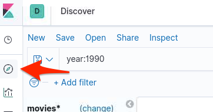
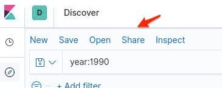
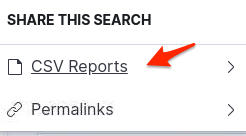
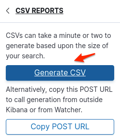
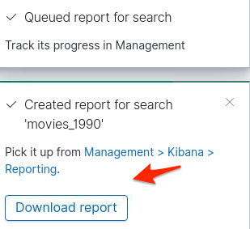
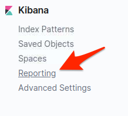
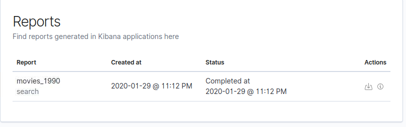

# Elastic Stack Lab 23
In this we are going to generate a Kibana report.

You can generate a report that contains a Kibana dashboard, visualization, saved search, or Canvas workpad. Depending on the object type, you can export the data as a PDF, PNG, or CSV document, which you can keep for yourself, or share with others.

Reporting is available from the **Share** menu in **Discover**, **Visualize**, **Dashboard**, and **Canvas**

### Setup  
X-Pack reporting is automatically enabled in Kibana. The first time Kibana runs, it extracts a custom build for the Chromium web browser, which runs on the server in headless mode to load Kibana and capture the rendered Kibana charts as images.

Chromium is an open-source project not related to Elastic, but the Chromium binary for Kibana has been custom-built by Elastic to ensure it works with minimal setup. However, the Kibana server OS might still require additional dependencies for Chromium. See the [Reporting](https://www.elastic.co/guide/en/kibana/current/reporting-troubleshooting.html#reporting-troubleshooting-system-dependencies) troubleshooting section for more information about the system dependencies for different operating systems.

### Roles and privileges
To generate a report, you must have the reporting_user role. You also need the appropriate Kibana privileges to access the objects that you want to report on and the Elasticsearch indices.

### Reporting and security
Reporting operates by creating and updating documents in Elasticsearch in response to user actions in Kibana.

 - To use X-Pack reporting with X-Pack security enabled, you need to set up Kibana to work with X-Pack security. If you are automatically generating reports with Watcher, you also need to configure Watcher to trust the Kibana server’s certificate.

 - To enable users to generate reports, you must assign them the built-in reporting_user role. Users will also need the appropriate Kibana privileges to access the objects to report on and the Elasticsearch indices.  

###  Generate a report manually

1. Open the discover, dashboard, visualization, Canvas workpad, or saved search that you want to include in the report.
Let's work with discover.  Click on the compass icon to take you to the discover dash.  

2.  In the Kibana toolbar, click Share. If you are working in Canvas, click the share icon Canvas Share button.

3.  Select the option appropriate for your object. You can export:
 - A dashboard or visualization as either a PNG or PDF document(**Not available in the basic license**)
 - A Canvas workpad as a PDF document(**Not available in the basic license**)
 - A saved search as a CSV document
 - Generate the report.
 Make sure you **save first** before sharing.
 Let's click on **CSV Reportss**

 

 4.  Click on **Generate CSV**

 

You should get a pop up letting you know a report was created.
A notification will appears when the report is complete.

### View and Manage

1.  Let's go to **Management** to pick up the report.  It is the gears icon on the left.  

 

You should be brought to the management dash.

2.  Click on **Reporting**

 

Here you can monitor the generation of a report and download reports that you previously generated.

 
